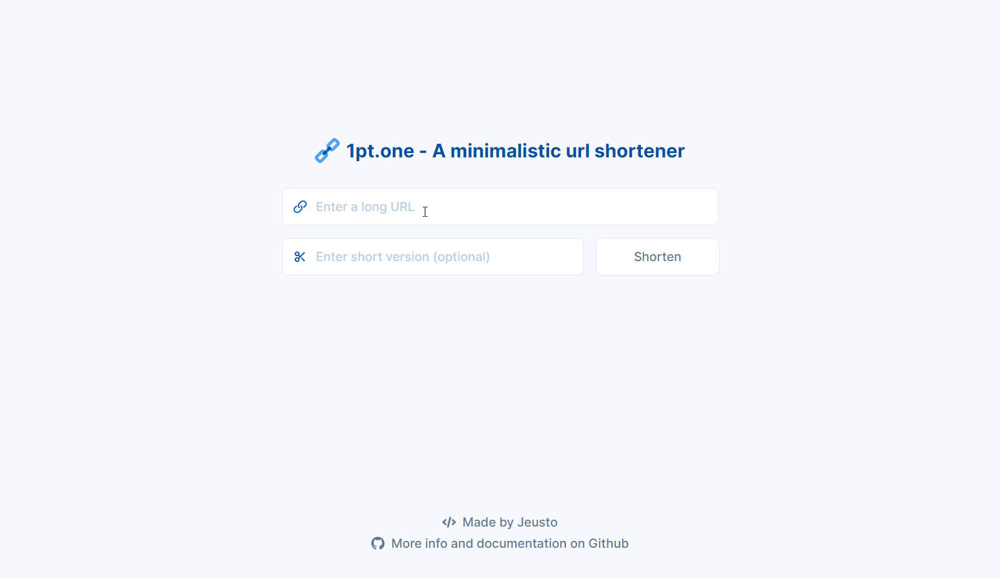

# 1pt.one - A minimalistic URL shortener

A minimalistic URL shortener. Create a short URL in seconds and track the number of visits with the website or the api.
You can use the service with the [website 1pt.one](https://1pt.one/) or the [CLI tool](https://github.com/Jeusto/1pt.one-cli).



## API

### `/shorten`

#### Method: `GET`

| Parameter | Description                                 | Example              |
| --------- | ------------------------------------------- | -------------------- |
| `long`    | **Required** - The long URL to shorten      | `https://github.com` |
| `short`   | **Optional** - The short version of the url | `gth`                |

#### Example Response

`1pt.one/shorten?short=gth&long=https://github.com`

```json
{
  "status": 201,
  "message": "Successfully added short url!",
  "short_url": "gth",
  "long_url": "https://github.com"
}
```

### `/retrieve`

#### Method: `GET`

| Parameter | Description                                 | Example |
| --------- | ------------------------------------------- | ------- |
| `short`   | **Optional** - The short version of the url | `gth`   |

#### Example Response

```json
{
  "status": 200,
  "_id": 6,
  "short_url": "gth",
  "long_url": "https://github.com",
  "created_at": "18/09/2021 20:26:17",
  "number_of_visits": 2
}
```

### `/status`

#### Method: `GET`

#### Example Response

```json
{
  "status": 200,
  "message": "Api is live. Read the documentation at https://github.com/Jeusto/1pt.one"
}
```
